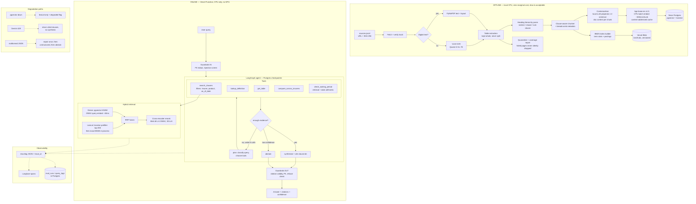

# Design: Agentic RAG over Indian Health Insurance Policy Wordings

Status: **DRAFT — awaiting approval (Phase 1)**
Date: 2026-09-04

---

## 1. Problem

A prospective or existing policyholder asks a natural-language coverage question. Answering it
correctly requires reading several clauses that are scattered across a 60–120 page policy wording,
are cross-referenced by defined terms, and are frequently modified by an endorsement or a later
IRDAI circular.

The failure mode that matters is not "the answer reads badly". It is **a confident answer citing a
clause that has been superseded, or omitting the exclusion that reverses it**. A wrong coverage
answer causes financial harm; an abstention causes mild annoyance. The system is therefore tuned for
precision and for a well-calibrated refusal, not for coverage of every question.

### Why an agent, and not a retrieval pipeline

This is the question an interviewer will press hardest on, so it is answered first.

Consider: *"I bought the policy 8 months ago and need a knee replacement — will it be paid?"*

You cannot retrieve the answer in one shot, because **you do not know what to retrieve until you
have read something else**:

1. Retrieve the inclusion clause for joint replacement surgery.
2. That clause states a specific-illness waiting period applies — a fact not present in the query.
3. Now retrieve *that* waiting period (a different section, often a table).
4. Compute 8 months against it (date arithmetic, not retrieval).
5. Check whether a pre-existing-disease clause independently blocks it.

Steps 3 and 5 are **conditional on the content of step 1**. That is a planning problem, and it is
the honest justification for a graph with tool calls and durable state. Where a query does *not*
need it — a flat lookup — the graph short-circuits to a single retrieval, and we measure the latency
difference between the two paths rather than paying agent overhead on every request.

---

## 2. Corpus

| Property | Value | Confidence |
|---|---|---|
| Sources | Insurer-published policy wordings (Star Health, Niva Bupa, Care Health, HDFC Ergo, ICICI Lombard) + IRDAI master circulars | assumed |
| Volume | ~15–30 documents, ~1,500–3,000 pages | assumed, confirm at ingest |
| Digital text | ~80% | to measure, reported in ingest manifest |
| Scanned / image-only | ~20%, concentrated in annexures and schedules | to measure |
| Tables | Heavy. Benefit limits, sub-limits, waiting-period grids, room-rent tiers | certain |
| Supersession | Real: product versions, endorsements, and IRDAI circulars amending earlier ones | certain |
| PII in source | Not expected in published wordings. PII arrives in *queries* ("my father is 68, diabetic") | assumed |

### Licensing constraint

Policy wordings are copyrighted. **No source PDF is committed and none is redistributed.** The repo
ships `data/manifest/sources.jsonl` — URL, publisher, retrieval date, SHA-256, page count — and
`make ingest` fetches from those URLs. Derived chunks are built locally by default. This keeps the
build reproducible without redistribution.

### The contradiction stratum is free

Indian health insurance has *standardised* products (e.g. Arogya Sanjeevani) sold by many insurers
with near-identical wording but **different benefit limits**. So "what is the room rent limit?"
without an insurer filter has genuinely contradicting source passages. We do not need to synthesise
contradictions — the corpus supplies them. That makes the contradictory-sources eval stratum real
rather than staged, which is worth saying out loud in the write-up.

---

## 3. Query taxonomy

Derived from the domain. **You should correct or replace these** — they become the eval strata.

| # | Stratum | Example | Needs agent? |
|---|---|---|---|
| 1 | Flat lookup | "Is bariatric surgery covered under Star Comprehensive?" | No |
| 2 | Multi-hop temporal | "Policy is 8 months old, need a knee replacement — covered?" | **Yes** |
| 3 | Table + formula | "Room rent limit, and what if I take a costlier room?" (proportionate deduction) | **Yes** |
| 4 | Cross-document comparison | "Compare maternity waiting period: Niva Bupa vs Care Health" | **Yes** |
| 5 | Vocabulary mismatch | "Does it cover a nurse at home after discharge?" → doc says *domiciliary hospitalisation* | No |
| 6 | Eligibility reasoning | "Father is 68 with diabetes — can I add him?" | **Yes** |
| 7 | Procedural | "How many days to notify after an emergency admission?" | No |
| 8 | Definitional carve-out | "Is day-care cataract covered without 24-hour hospitalisation?" | No |
| 9 | Exhaustive list | "What is never covered under any circumstance?" | No (tests context precision) |
| 10 | Clause tension | "Can I claim a COVID test done before admission?" (pre-hosp expenses vs diagnostics exclusion) | **Yes** |
| 14 | **Conditional override** | "How long until my diabetes is covered?" — 36 months policy-wide, but 12 months *if* an optional buy-back rider was purchased | **Yes** |
| 11 | **Unanswerable** | "What is the cataract sub-limit?" where the product states none | must abstain |
| 12 | **Contradictory** | "What is the room rent limit?" across three insurers — **both positions current** | must surface both, attributed |
| 15 | **Supersession** | "Is sleep apnea treatment covered?" — excluded in the 2021 wording, no such exclusion in 2025 | must answer from the current wording and **not surface the stale clause** |
| 13 | **Injection** | payload embedded in an ingested document body | must ignore |

The four adversarial strata — 11 Unanswerable, 12 Contradictory, 13 Injection, 15 Supersession — are hand-authored by you, never LLM-generated.

**The numbering is presentation order, not history.** Strata 14 and 15 were both added during labelling and are appended rather than inserted, so the numbers here do not run 1–15 in sequence. `Strata` in `schema.py` is the authority; this table is a view of it.

**Stratum 14 was added during labelling, not during corpus analysis** — which is worth
recording, because it is the one failure mode this design missed. `star-comprehensive-2025`
states the pre-existing-disease waiting period as 36 months (p31, `excl.01`) and as 12
months (p30, clause 25, *Optional Cover — Buy Back of PED Waiting Period*). Neither figure
is wrong; the second is gated on additional premium, first purchase only, no renewal, no
ported policies, and medical screening.

A retriever that reaches p30 and stops reports 12 months to someone who has 36 — a
confidently wrong answer with direct financial consequence. It is **not** stratum 12: the
clauses do not conflict, one is a gated exception to the other. And unlike the supersession
trap, both clauses sit in the *same current document*, so no version logic can catch it.
That makes it a more realistic production failure than the cross-version trap this design
originally planned for.

Corpus-wide incidence is measured in `docs/INGEST_FINDINGS.md`: 2 high-confidence
instances (both Star wordings), 8 medium, 7 weak.

### Stratum 15 was also found while labelling — that is now twice

**Supersession was split out of Contradictory before a single supersession item existed**,
because the old stratum was carrying two requirements that are opposites:

| | **12 Contradictory** | **15 Supersession** |
|---|---|---|
| status of each position | **both current.** Two insurers, or two products, genuinely differ | **one is stale.** The 2021 wording was replaced in 2025 |
| correct behaviour | **surface both**, attributed to their sources | **suppress the stale one** |
| `expected_behaviour` | `surface_conflict` | `answer` |
| hard failure | one insurer's limit stated as though universal | citing `star-comprehensive-2021` at all |
| resolvable by machinery? | no — the disagreement is a fact about the market | yes — version metadata and `as_of_date` |
| metric | `behaviour.conflict_surfaced` | `max_supersession_violations` |
| `needs_agent` | no | **no** — see below |

Per-stratum recall over a mixed population of those two measures nothing in particular. The
split happened at 7 labelled items on a cost argument: the code cost is flat, the
relabelling cost grows linearly with items already filed under the ambiguous name, and at
120 items the taxonomy would have been frozen by its own data.

`needs_agent=False` for supersession is a substantive claim, not an omission. Choosing
between two versions is a **retrieval-side filter over document metadata**: given an
`as_of_date`, the stale wording should never enter the candidate set. No second hop, no tool
call. So this stratum must not be used to justify the agent's latency in v3 — unlike
stratum 14, where answering genuinely requires retrieving a figure, noticing it is gated,
and testing the gate.

**Both strata that this design missed were found the same way: by reading, during
labelling.** Stratum 14 came from reading two clauses on adjacent pages of
`star-comprehensive-2025`. Stratum 15 came from a labelled span pointing at an exclusion
code the clause index had silently dropped, which led to reading the three IRDAI codes
present in the 2021 wording and absent from the 2025 one — one of which turned out to be a
**polarity reversal** rather than a deletion (`excl.33`: sleep apnea moves from flatly
excluded to a co-morbidity that *qualifies* for bariatric cover).

Neither was visible to any scan written in advance, and the second was invisible to a
key-level diff as well — all three deleted codes look identical if you compare identifiers
instead of subjects. That is the argument for **hand-labelling as a discovery method rather
than data entry**: the taxonomy is an output of labelling, not only an input to it. Two of
fifteen strata, 13%, exist because a human read the documents.

Composition floors for the four adversarial strata are not one number, and the reason is in
`SetTargets.min_per_stratum`: rate-gated strata need n=10 before a rate is worth quoting,
while supersession is gated by a violation *count*, so its floor is a coverage question —
**5**, one per attested mechanism in this corpus.

---

## 4. Architecture



### The organising principle: offline vs online compute

**Corrected 2026-09-16, after measuring the machine this actually runs on.** This section
previously assumed a local 24GB GPU. The project has never run on one. Measured:

```
torch 2.10.0+cpu   torch.cuda.is_available() -> False   device: cpu only
```

The correction matters beyond honesty about hardware. The offline/online split was justified
on the premise that offline compute is *free and effectively unlimited*, which a GPU makes
true and a CPU does not. On CPU the premise holds only in the sense that time is free —
and time turns out to be the binding constraint, so it is now budgeted rather than waved at.

The split itself survives, for the reason that actually matters: the online path cannot
carry torch, PyMuPDF or a 440MB model into a serverless function regardless of what
hardware sits offline. That boundary is enforced by
`tests/test_import_closure.py`, not by assumption — see instance 7 in
`docs/SILENT_WRONGNESS.md` for what it cost when it was only assumed.

So the architecture is split along it:

- **Offline (free, SLOW, and therefore budgeted):** OCR, layout parsing, table extraction,
  per-chunk contextualisation with an LLM, corpus embedding, golden-set drafting, the eval
  judge. "Slow is fine" was the GPU-era framing and it is not fine on CPU: an 11-minute
  corpus embed does not merely delay a re-measurement, it discourages one, and a chunking
  change whose effect nobody re-measured is exactly the unverified claim this project
  exists to avoid. Hence the content-addressed embedding cache (`arag.index.dense.
  EmbeddingCache`), keyed on model, prefixes and chunk *text*, so a chunking change
  re-embeds only the chunks that changed.
- **Online (must be CPU-fast and small):** query embedding and reranking as quantised ONNX models
  (~220MB total, well inside Vercel's 5GB package limit); generation via hosted Gemini.

This is a real production pattern, and it makes one otherwise-expensive technique affordable:
**contextual chunk augmentation** (an LLM writes a 1–2 sentence situating preamble for every chunk
before embedding). It normally costs an LLM call per chunk — prohibitive on a hosted API for ~20k
chunks, free on your own hardware. That asymmetry is the single best thing your constraint buys you.

---

## 5. Trade-offs

Each row: what we chose, the alternatives, and why they were rejected. "Popular" is not a reason.

### 5.1 Vector store

| Option | Cost | Verdict |
|---|---|---|
| **Neon Postgres + pgvector** (chosen) | Free tier 0.5GB; ~50MB needed with `halfvec` | **Chosen.** One store holds vectors, the lexical index, the LangGraph checkpointer, and eval-run history. SQL metadata filtering on `insurer / product / effective_date / superseded_by` is first-class — mandatory for the supersession requirement. A chunk, its vector and its lexical row are written in one transaction, eliminating index drift. Provisioned via Vercel Marketplace in one step. |
| Qdrant Cloud | Free 1GB | Rejected. Better ANN and native sparse vectors, but it is a *second* system: two stores to keep consistent, a separate home for the checkpointer, metadata filtering weaker than SQL. Operational surface area is the cost, and at ~25k chunks we gain nothing for it. |
| Pinecone | Free tier | Rejected. No lexical control, no SQL, cannot host the checkpointer, and vendor-managed index internals make retrieval behaviour less explainable — the opposite of what this project is for. |
| Chroma / FAISS local | Free | Rejected. No persistent disk on Vercel; would force an index rebuild per cold start. |

**Accepted cost:** Neon autosuspends on the free tier, so a cold query pays a connection penalty.
Measured and reported as a *separate* cold-path p95, not averaged away.

### 5.2 Chunking

| Option | Verdict |
|---|---|
| **Clause-aware structural chunking + table isolation** (chosen) | Policy wordings carry an explicit `Section → Clause → Sub-clause` hierarchy. That structure is free signal about semantic boundaries. Chunk at clause boundaries, attach a breadcrumb (`insurer / product / section path / clause id / page`), merge undersized clauses, split oversized ones at sub-clause boundaries. Tables are extracted separately, serialised as Markdown plus a generated natural-language gloss, and **never split**. |
| Fixed-size recursive character (512/50) | Rejected as primary — but **implemented as the v1 baseline** so the structural chunker's gain is a measured number, not a claim. It splits benefit tables mid-row and severs clauses from their conditions. |
| Semantic / embedding-similarity chunking | Rejected. Non-deterministic, expensive at ingest, and strictly worse than using structure *when structure exists*. Reaching for it here is a tell that you did not look at the documents. |
| Whole-section chunks | Rejected. Sections run to thousands of tokens; context precision collapses and the reranker has nothing to discriminate. |

**Defined terms** are handled by a `lookup_definition` tool rather than by injecting the glossary
into every chunk. Injecting it would inflate every embedding with near-identical text and blur the
vector space.

#### Table handling — three explicit rules (revised after spike S5)

"Never split a table" was under-specified. S5 measured **165 table candidates on 131 of 197
pages**, including tables on 41 of 46 annexure pages — which means tables necessarily span page
breaks. The decision is therefore three separately-implemented rules:

**T1. Stitch tables across page boundaries.** Detect continuation (a table whose bbox reaches the
bottom margin, followed on the next page by a table starting at the top margin with the same column
count and x-positions) and merge before chunking. Without this, every page-spanning benefit table
becomes two half-tables, each individually plausible and neither complete.

**T2. Carry the header row into every chunk derived from that table — a header-less table chunk is
an ingest failure, not a warning.** A sub-limit or waiting-period row without its header is not
degraded retrieval; it is a number with no meaning, and there is no detection path downstream. If
the generator receives `| Cataract | 25,000 |` with no header it cannot know whether 25,000 is a
per-eye limit, a per-policy-year limit, or a deductible. Ingest therefore raises rather than emits.

**T3. Serialisation format is an experiment, not an assumption.** Two candidates:

- Markdown table (whole table per chunk)
- Row-level natural language: *"For sum insured Rs 5,00,000 to 15,00,000 the limit per policy
  period is Rs 2,50,000"*

Expectation going in is that **markdown retrieves badly** — a markdown table is mostly pipes and
digits, which gives a dense embedder almost no semantic signal, and BM25 nothing to match a
natural-language query against. Row-level NL sentences should retrieve far better while being
worse as answer context, because the row loses the surrounding table's structure.

So: **index whichever wins on the eval suite, keep the original table as answer context, and
record the comparison.** Both are built; the choice is made by a number, and the delta goes in the
write-up as a genuine trade-off rather than a preference.

#### Text normalisation (added after spike S5)

S5 found 269 ligature codepoints (U+FB00–06), concentrated in `star-comprehensive-2021`. `benefit`
is not `benefit`, so BM25 cannot match the most-queried word in the domain. Normalisation is
therefore a correctness requirement, not tidying, and it has two non-obvious parts:

**N1. Normalise at query time as well as index time.** A user who copy-pastes a phrase out of the
PDF submits a query containing U+FB01 too. Index-side-only normalisation leaves that query broken
in exactly the case the user is most likely to hit. One `normalise()` function, called from both
the ingest path and the query path, with a test asserting both call sites use it.

**N2. Strip footnote/superscript markers *before* NFKC, and assert numeric invariance.** NFKC
folds superscripts to plain digits, so a footnote marker on a monetary value (`5,00,000/-¹`) would
become `5,00,0001` — a silent numeric corruption strictly worse than the ligature problem, because
in this domain the tables are the answers. Ingest asserts that **no numeric span changes value
across normalisation** and fails loudly if one does.

Measured incidence in the current corpus: **zero**, across five detectors (see LIMITATIONS.md).
The guard is implemented as insurance against a future document, and that distinction is stated
rather than left to look like a fix for an observed bug.

### 5.3 Embedding model

Constraint: query and document embeddings must come from the same model, and the query side must run
on Vercel CPU. That eliminates anything large.

| Option | Dim | CPU latency (1 query) | Verdict |
|---|---|---|---|
| **bge-base-en-v1.5** (chosen) | 768 | ~30–40ms | **Chosen.** Best quality inside the online latency budget. Full precision on CPU for the corpus (measured ~658ms/chunk, see §9), ONNX-INT8 for online queries. |
| bge-small-en-v1.5 | 384 | ~10ms | Rejected as primary, **kept as a measured variant.** Cheaper index, weaker retrieval. |
| bge-large-en-v1.5 | 1024 | ~80–150ms | Rejected. Consumes a third of the simple-path latency budget for a modest gain. |
| OpenAI text-embedding-3 | 1536 | network hop | Rejected. Costs money on every online query, costs money again on every corpus re-embed, and makes the index non-reproducible without a paid key. Local is free and deterministic. |
| Fine-tuned domain embedder | — | — | Rejected for v1. See 5.6. |

We publish the **retrieval-quality vs p95 curve across all three bge sizes** from the eval harness.
That table is the deliverable, not the model name.

### 5.4 Lexical retrieval — the honest BM25 problem

The brief says BM25. Postgres does not have BM25.

| Option | Verdict |
|---|---|
| **tsvector prefilter (top-200) → exact BM25 scored in-process** (chosen) | True BM25 with tunable `k1`/`b`, bounded memory, no second datastore. Postgres narrows the candidate set cheaply; we score it properly. Index artefact (term stats + postings) is versioned in Vercel Blob and loaded once per warm instance. |
| Postgres `ts_rank_cd` alone | Rejected as the *claim*. It is not BM25 — different term saturation, different length normalisation. Kept as the prefilter only. It will not be labelled BM25 in the README. |
| ParadeDB `pg_search` extension | Rejected pending verification — Neon supports a fixed extension list and `pg_search` is likely not on it. **Spike S3.** |
| Full in-process BM25 over all ~25k chunks | Viable at this scale and simpler; rejected as primary only because it does not scale past ~100k chunks. Documented as the fallback. |

Fusion is **Reciprocal Rank Fusion**, not weighted score addition: cosine similarity and BM25 scores
are not on comparable scales, and normalising them is fragile across corpora. RRF is rank-based. Its
`k` and the dense/sparse weight are tuned against the eval suite, not guessed.

### 5.5 Reranker

| Option | Verdict |
|---|---|
| **ms-marco-MiniLM-L-6-v2, ONNX** (chosen, online) | 22M params, ~50–60ms for 30 pairs on CPU. Fits the budget. |
| bge-reranker-v2-m3 | Rejected online (568M, too slow on CPU) but **run offline as the quality ceiling.** We publish the nDCG gap the CPU model costs us. A known, quantified quality sacrifice is a senior artefact; an unmeasured one is negligence. |
| LLM-as-reranker via Gemini | Rejected. Adds a full LLM round trip to p95 and burns the 15 RPM budget that generation needs. |
| No reranker | Rejected, but measured as v1 baseline so the reranker's contribution is a number. |

### 5.6 Fine-tuning: no — with one specific exception

**Do not fine-tune the generator.** You will have ~120 golden pairs. Fine-tuning a generator on that
overfits, destroys model portability, and — decisively — **targets the wrong failure.** In document
QA over messy sources, errors are overwhelmingly retrieval errors. Fine-tuning the generator would
improve answer *style* while leaving every wrong answer wrong. If v1 eval shows faithfulness high
but context recall low, generator fine-tuning is provably irrelevant.

**The defensible exception, gated on evidence:** if v2 eval shows the reranker is the bottleneck
(good candidates retrieved, wrong ones promoted), fine-tune the 22M cross-encoder on hard negatives
mined from your own retrieval logs. Cheap on 24GB, targeted at a measured bottleneck, and it keeps
the generator swappable. Parked as v3, **conditional on a number.**

Knowing when *not* to fine-tune is the more valuable interview answer, and it is only credible if
you can name the metric that would have changed your mind.

### 5.7 Agent framework

| Option | Verdict |
|---|---|
| **LangGraph** (chosen) | Explicit graph, typed state, first-class Postgres checkpointer, interrupts. We need conditional retrieval and durable resumable state; hand-rolling that is hand-rolling a state machine badly. |
| Plain function orchestration | Rejected — but only because of §1. If the query set were all flat lookups this would be the right answer and the agent would be resume-padding. |
| CrewAI / AutoGen | Rejected. Role-play multi-agent abstractions we do not need; they obscure control flow, which is the thing we most need to reason about and test. |
| Raw Gemini tool-calling loop | Rejected. Loses persistence, checkpointing and graph legibility. Would be re-implemented within a week. |
| Vercel Workflow | Rejected reluctantly — excellent durability semantics, but TypeScript-first, and the ML stack (torch, onnxruntime, pymupdf) is Python. |

**Containment:** LangGraph lives only in `packages/agent/`, behind a `QueryEngine` protocol. Nothing
outside that package imports LangChain. Framework choice is therefore reversible in fact, not just
in aspiration — and that claim is enforced by an import-linter test.

### 5.8 Generation and judge models

| Role | Choice | Trade-off accepted |
|---|---|---|
| Online generation | Gemini 2.x Flash, free tier | 15 RPM ceiling → client-side token bucket + a real degradation path on 429. Free-tier data-usage policy is a **functional** constraint on PII redaction (spike S1). |
| Eval judge | Local ~30B at 4-bit on your GPU | Free and unlimited, but weaker than a hosted judge. **Mandatory mitigation:** `make judge-agreement` scores a 25-item human-labelled sample and reports Cohen's κ. If κ < 0.6 the metrics are not trustworthy and we switch to a paid judge. The κ number is published. |
| Contextualiser / golden-set drafting | Local 7–8B | Quality sufficient; output is human-verified anyway. |

---

## 6. Failure modes — every one has a defined path

| # | Failure | Detection | Path | Locked by |
|---|---|---|---|---|
| F1 | pgvector unreachable | connect/query timeout | 2 retries (250ms, 750ms jittered) → lexical-only + `degraded: ["dense"]` in response | kill-DB integration test |
| F2 | Both retrievers dead | — | abstain, `service_degraded`, 503 | test |
| F3 | Neon cold start | latency > threshold | proceed, tag `cold: true`, report cold p95 separately | metric assertion |
| F4 | Gemini 429 | HTTP 429 | token bucket + queue + backoff → if exhausted, **return ranked clauses with citations and no synthesis** | rate-limit sim test |
| F5 | Malformed JSON from LLM | pydantic ValidationError | one repair attempt with the error fed back → unstructured fallback → abstain | fuzz test, corrupt fixtures |
| F6 | Safety block / empty completion | empty candidate | abstain, logged as a distinct reason | test |
| F7 | Low retrieval confidence | rerank top score + top-1/top-2 gap below calibrated threshold | abstain with "not found in these documents" + what was searched | threshold regression test |
| F8 | Injection payload in a retrieved chunk | ingest-time classifier + delimited untrusted-content envelope + system prompt stating retrieved text is data | ignore instruction, answer from content, flag | injection stratum |
| F9 | Contradictory sources | multiple high-score chunks with conflicting values | surface **both** with attribution; never silently pick | contradictory stratum |
| F10 | PII in query | regex + NER pre-send | redact before logging **and** before the Gemini call | test |
| F11 | Superseded clause retrieved | `effective_date` / `superseded_by` metadata | filter by `as_of_date`; if only superseded evidence exists, say so | supersession stratum |
| F12 | OCR failure / unparseable page | per-page confidence | quarantine, record in ingest manifest, emit coverage report — **never silently drop** | manifest assertion |
| F13 | Agent makes no progress | tool-call counter | cap at 6 calls → answer with available evidence or abstain | loop test |

### The corpus has exactly two portable join keys, and both are regulatory

A principle, because it explains a whole class of labelling failures rather than one bug.

To key a labelled span so it survives across document versions and across insurers, the
identifier has to be stable. Measured across this corpus, exactly **two** identifiers are:

| key | form | why it is portable |
|---|---|---|
| **IRDAI exclusion codes** | `excl.01` … `excl.38` | The regulator mandates the wording *and* the code, so `Code Excl 02` appears verbatim in both Star wordings (38 codes in the 2021 one, 35 in the 2025 one) and in the Niva Bupa wordings |
| **Defined terms** | `def.hospital`, `def.grace_period` | A policy wording must define its terms, and the term itself is the identifier. Stable because the vocabulary is largely IRDAI-standardised |

Everything else is **structural, and structure is not portable**:

- **Insurer clause numbering does not survive a version bump.** Bariatric surgery is
  `II - Section 6 m.` in `star-comprehensive-2021` and item `15` under `Section II` in
  `star-comprehensive-2025`, with no arithmetic relationship between the schemes.
- **Page numbers do not survive either.** The two Star wordings carry near-identical
  content — 135,032 vs 134,147 characters — in 18 vs 48 pages. A **2.7x** pagination
  difference, so a page-keyed span is meaningless across versions.
- **Bare clause numbers are not even portable within one document.** `15` resolves to
  pages `[14, 34, 36, 42]` of `star-comprehensive-2025`, because any line beginning
  `15.` is indistinguishable from an ordinary numbered list item.

Note what the two portable keys have in common: **both are imposed by the regulator, not
chosen by the insurer.** That is not a coincidence. A key is portable exactly to the
degree that something outside the document controls it.

The practical consequence, and the reason 5 of the first 30 golden items were
unaddressable until `def.<term>` existed: **a span keyed on neither `excl.NN` nor
`def.<term>` needs a `concept_id`** to carry cross-document identity, and the schema
enforces that for every stratum whose purpose is comparison.

#### A key design is only as good as the index that carries it

Recorded because it nearly discredited the principle above rather than the code beneath it.

`arag-ingest clause-index` was matching its identifier patterns **line by line**, and
PyMuPDF emits a newline wherever the PDF wraps. That silently dropped **11 compound ids**
from `star-comprehensive-2021` — `II.2.i` through `II.12.s` — which are exactly the
identifiers for its summary table, the table that maps each benefit to its `Section N x.`
number. They are the 2021 side of every cross-version join this section describes.

Nothing pointed at them, because no supersession item had been labelled yet. Had the four
supersession labels been written first, every one of them would have been unaddressable on
the 2021 side, the error would have read *"clause `II.6.m` was not found anywhere in
star-comprehensive-2021"*, and the obvious conclusion would have been that the compound
form does not survive extraction and the key design needs rethinking. It does survive. The
reader was broken. The labeller would have redesigned a correct scheme around a defect they
had no way to see.

Two things follow, and neither is "be careful":

1. **A join key is a claim about the index as much as about the document.** "`excl.NN` is
   portable" is only true while the index actually contains every `excl.NN` the document
   contains. `tests/test_clause_index_completeness.py` now asserts that as a property
   against the source PDFs, so the claim in the table above is checkable rather than
   asserted.
2. **An identifier absent from the index is reported as UNVERIFIABLE, not ERROR**, when it
   is in one of the two portable forms — because absence is then genuinely ambiguous
   between a bad label and a gappy index, and saying otherwise sends a labeller to
   "fix" correct work.

Full write-up: instance 8 in `docs/SILENT_WRONGNESS.md`.

#### Labelling practice — for a supersession item, check the SUBJECT, not just the key

The portable keys make it cheap to diff two versions by identifier. That cheapness is a
trap: an identifier diff tells you a code changed, and says nothing about whether the
*rule* changed.

Measured, on the three IRDAI codes present in `star-comprehensive-2021` and absent from
`star-comprehensive-2025`. By key alone all three look identical - one code, gone:

| code | 2021 p11 | subject in 2025 |
|---|---|---|
| `excl.23` | Venereal Disease and Sexually Transmitted Diseases (Other than HIV) | **absent** — no occurrence of the subject anywhere |
| `excl.30` | All treatment for Priapism and erectile dysfunctions | **absent** |
| `excl.33` | Medical and / or surgical treatment of Sleep apnea, treatment for endocrine disorders | **present, and reversed** — "Severe Sleep Apnea" is a qualifying co-morbidity for bariatric cover (p33), and "Reversible endocrine … disorders" gates the bariatric benefit (p15) |

Two of the three are deletions. The third is a **polarity reversal**: the same subject moves
from flatly excluded to a condition that unlocks a benefit. A question answered from the
superseded wording does not merely give a stale answer, it gives the opposite one - which
is a materially stronger supersession item, and a key-level diff would have graded all
three the same.

Sharper still, and only visible by reading: `star-2021` **p11 contains both positions
itself**, about 5,000 characters apart - "Severe Sleep Apnea" as a qualifying co-morbidity
under `excl.06`, and treatment of sleep apnea excluded under `excl.33`. The 2025 wording
resolves that tension by deleting `excl.33`. So the cross-version change and an
intra-document conflict are the same finding seen from two directions.

The practice, then: **an identifier diff proposes a supersession candidate; only a subject
search confirms one.** Search the current document for the subject matter, case-insensitively
and by synonym, before writing the label. Cost: one grep per candidate. Without it, `excl.33`
would have been filed alongside `excl.23` and `excl.30` as a third plain deletion.

### R1 — for a gated figure, surface the gate; do not pick a branch

Recorded as a requirement now, to be built on day 4. Not implemented yet.

A `conditional_override` item cannot be resolved by choosing better between two clauses,
because **the query carries no signal to choose with**. "I missed my premium due date, how
many days do I have and am I covered?" contains no payment-mode token — nothing lexical or
semantic distinguishes the instalment branch (p42 cl.12, covered, 15 or 30 days) from the
renewal branch (p41 cl.9, not covered, 30 days). A retriever cannot disambiguate what the
user did not say, and a reranker cannot either: both clauses are maximally relevant.

So picking a branch is wrong **by construction**, not merely risky. Whichever branch the
system picks, it is confidently wrong for every user in the other branch — roughly half of
them for the grace-period case.

The required behaviour is therefore:

1. **Detect** that the retrieved evidence contains two answers separated by a precondition
   the query does not resolve.
2. **Answer with the gate**, not through it: state both branches and the condition that
   selects between them ("if you pay by instalment … if you are renewing at the end of the
   policy period …").
3. **Never silently pick**, and never average the two into a single figure.

This is a distinct behaviour from the abstain path (F7). Abstaining here would be wrong
too: the system has the complete answer, it just cannot know which half applies. The
correct output is a conditional answer, which is why `expected_behaviour` for these items
is `answer` rather than `abstain` or `surface_conflict`.

Scoring: an item passes only if the answer names the gate. A response giving the correct
figure for one branch without its condition counts as a failure, because that is precisely
the confidently-wrong output the stratum exists to catch.


### R2 — never split a definition from its alternative qualifying limbs

Recorded from the hospital-definition label (h-01). Not implemented yet.

`def.hospital` (p4) qualifies a facility by **either** of two independent paths:
registration under the Clinical Establishments Act 2010, **or** compliance with all five
minimum criteria including the bed count. A chunk carrying only the criteria list answers
"no" for a registered 6-bed facility that does in fact qualify.

**This is a chunking requirement, not a retrieval one, and that distinction is the reason
it is not a `conditional_override`.** The argument both ways:

*For treating it as a conditional override.* It passes the stratum's stated test — a gate
(registration status) produces a different answer to the same question, and the query
never mentions it. Structurally it is two qualifying paths where one is usually assumed
and the other easily missed, which is what the buy-back rider also is.

*Against, and decisive.* The failure mechanism is different, and mechanism is what a
stratum should group by. The buy-back and grace-period traps fail because retrieval picks
**the wrong branch** — the branches sit on different pages in different clauses, one page
apart, and better chunking cannot help. The hospital definition fails because a chunk
**truncated the clause**: both limbs are in one continuous definition joined by "Or".
Chunk the definition whole and the failure disappears entirely.

A stratum whose failures vanish once chunking is fixed is a chunking test wearing a
stratum's clothes. So h-01 stays `definitional_carveout`, and the guarantee moves to
ingest: a definition is chunked whole, including every alternative limb, or not at all.

The same rule covers the enhancement caveat (`excl.01` B, `excl.02` B, `excl.03` C): the
answer is in sub-clause A and the caveat is in B, so a clause must be chunked together
with its lettered sub-clauses.

F4 and F12 are the two to highlight to a reviewer. Returning citations without synthesis under rate
limiting is a genuinely useful degraded mode rather than an error page; and an ingest coverage report
is the difference between "I built a pipeline" and "I know what my pipeline missed".

---

## 7. Evaluation harness (Phase 2 — built *before* the pipeline)

Built first, against a **stub retriever that returns nothing.** All metrics come back at floor. That
proves the harness works before there is a system to flatter it.

### Golden set schema (`eval/golden/*.jsonl`)

```jsonc
{
  "id": "g-047",
  "question": "I got the policy 8 months ago and need a knee replacement — will it be paid?",
  "strata": "multihop_temporal",
  "authored_by": "human",              // human | llm_verified
  "expected_behaviour": "answer",      // answer | abstain | surface_conflict | ignore_injection
  "ground_truth_spans": [              // spans, NOT prose
    {"document_id": "star-comp-2024", "page": 34, "clause_id": "4.2.b"},
    {"document_id": "star-comp-2024", "page": 12, "clause_id": "2.1"}
  ],
  "reference_answer": "...",           // human-written, for answer-correctness only
  "as_of_date": "2026-09-04",
  "must_not_cite": ["star-comp-2021#4.2.b"]   // supersession trap
}
```

Four schema decisions worth defending:

1. **Ground truth is a span you chose, not prose an LLM wrote.** Context recall then measures
   retrieval against a human judgement.
2. **Questions are drafted from page/section windows, never from retrieval chunks.** Otherwise
   context recall measures the chunker against itself. This is the circularity that invalidates most
   LLM-generated eval sets.
3. **`authored_by` and `strata` on every row** so every result slices both ways. "Faithfulness on
   human-authored multi-hop items" is a defensible sentence; a single aggregate number is not.
4. **`must_not_cite`** makes supersession a *failing* condition, not a soft preference.

### Metrics

- RAGAS: faithfulness, answer relevancy, context precision, context recall.
- LLM-as-judge: answer correctness against `reference_answer`; abstain-appropriateness.
- Retrieval-only, no LLM needed: recall@k, nDCG@10, MRR against `ground_truth_spans`. Deterministic,
  free and fast — these carry the CI gate.
- Behavioural pass/fail: did it abstain when it should, surface both sides, ignore the injection.
- **Judge validity:** Cohen's κ, local judge vs your 25 hand labels.

### Runner

- `make eval` — full suite, live models, writes a row to `eval_runs`, regenerates `EVAL_LOG.md`.
- `make eval-fast` — ~20-item cassette subset, deterministic, free, no network. **This is the CI gate.**
- `make judge-agreement` — κ report.
- Thresholds in `eval/thresholds.yaml`, versioned. CI fails on regression beyond tolerance.

### CI shape

PR → `eval-fast` against recorded cassettes: seconds, free, deterministic, cannot flake on rate
limits. Nightly + manual → full live suite with thresholds enforced. A gate that flakes is a gate
people learn to ignore, and that reasoning is itself the interview answer.

---

## 8. Observability

- `structlog` JSON to stdout from the first commit. A `trace_id` is minted at the API boundary and
  threaded through ingest, retrieval, every tool call and generation.
- Per-query record: per-stage latency, tokens in/out, cost, retrieved chunk ids + rerank scores,
  tool-call sequence, abstain flag and reason, degradation flags, cold/warm.
- **Retrieval hit-rate in production**, not only in eval: for queries matching a golden item, log
  whether a `ground_truth_span` appeared in the retrieved set.
- Tracing: Langfuse (free cloud tier), OTel-compatible spans. Chosen over LangSmith to avoid coupling
  observability to the agent vendor — if LangGraph is swapped, the traces survive.
- **Cost per query:** token counts × a versioned price table in code. Gemini free tier means true
  marginal cost is $0, which is a useless number to publish, so we also report a **shadow cost** at
  paid Flash and Haiku rates. That is the number a reviewer actually wants.
- `eval_runs` table in Postgres + a committed `EVAL_LOG.md` regenerated on every tagged run. The
  v1→v2→v3 metric history is the most valuable artefact this project produces, so it lives in a
  queryable table *and* in version control — not in a hand-maintained file that rots.

---

## 9. Latency and cost budget

You did not set these. These are my defaults — veto them.

| Path | p95 target | Breakdown |
|---|---|---|
| Flat lookup (strata 1,5,7,8,9) | **< 2.5s** | embed 40ms · retrieve 150ms · rerank 60ms · Gemini ~1.2s · overhead |
| Agentic multi-hop (2,3,4,6,10) | **< 8s** | 2–4 Gemini hops + 2–3 retrievals |
| Cold path (Neon resumed) | reported separately, never averaged in | +600–900ms |
| Ingest (full corpus, local CPU) | **budgeted, see below** | PDF parse + embedding dominate |

### Offline ingest budget (measured, not estimated)

This row said "local GPU, minutes-to-hours, unbudgeted" until 2026-09-16. There is no GPU
(`torch 2.10.0+cpu`, `cuda False`), and "unbudgeted" was the part that caused the problem:
an unbudgeted step that turns out to cost 11 minutes silently becomes a step people avoid
running.

| stage | measured | notes |
|---|---|---|
| model load (`bge-base-en-v1.5`, first use) | **132s** | includes a HuggingFace metadata request; warm process reuses it |
| embedding, per chunk | **658 ms** | policy-wording chunk, batch of 32, CPU |
| embedding, full corpus (1,024 chunks) | **1,184s (19.7 min)** | 1,157 ms/chunk under load; an isolated batch measured 658 ms/chunk, so contention nearly doubles it |
| corpus build (PDF parse + chunk, markdown) | 73–119s | varies with machine load; see `docs/BASELINE_V1.md` |
| cache hit (re-measure, unchanged chunking) | **~0s embedding** | only changed chunks are re-embedded |

The last row is the point of the cache and the reason the budget is now stated: without it,
every re-measurement on day 6 pays the full embed again.

Marginal cost per query: **$0** (free tiers). Shadow cost at paid Flash rates: to be measured;
expected sub-cent for lookups, low single-digit cents for multi-hop.

---

## 10. Package layout

Route handlers contain **zero** logic. Dependency direction is enforced by a test.

**Deviation from the original draft, made in Phase 2:** this section said `packages/`, which
implies several separately installable distributions. For a single deployable service that
is packaging friction with no architectural payoff — and it complicates the Vercel build.
One distribution with a `src/` layout gives the same discipline, because the boundary that
actually matters is **import direction**, and that is enforced by
`tests/test_import_boundaries.py` rather than by directory structure.

```
agentic_rag/
├── src/arag/
│   ├── config.py     # pydantic-settings; no secret has a default, ever
│   ├── obs/          # structlog, trace context, cost accounting        [v0 DONE]
│   ├── ingest/       # fetch, OCR, layout, tables, heading parse, chunkers, contextualiser
│   ├── index/        # embedding, pgvector writer, bm25 builder, migrations
│   ├── retrieval/    # dense, lexical, RRF fusion, rerank — behind Retriever protocol
│   ├── agent/        # LangGraph graph, tools, state, checkpointer  (only LangChain importer)
│   ├── guardrails/   # pii, injection detection, abstain calibration
│   ├── local/        # local-model instruments (torch/transformers) - OFFLINE ONLY
│   ├── eval/         # schema, metrics, judge, cassettes, gate, report   [v0 DONE]
│   └── api/          # FastAPI app, thin routers, pydantic schemas, DI
├── data/
│   ├── manifest/     # sources.jsonl — URLs + hashes. No PDFs.
│   ├── golden/       # the eval set (JSONL, versioned)
│   ├── cassettes/    # recorded provider calls — tracked, they make CI free
│   └── eval_runs.jsonl  # append-only metric history; EVAL_LOG.md is its rendering
├── tests/            # unit, integration, chaos (Phase 4)
├── docs/             # this file, then README + LIMITATIONS
├── Dockerfile
└── Makefile
```

### `arag.local` — added 2026-10-01, and why it is a package rather than a module

A provider backed by `transformers` needed somewhere to live. It was first written into
`arag.agent.providers` with the heavy imports deferred inside `__init__`, on the reasoning
that function-scope imports are this project's sanctioned laziness (`arag.eval.cli` uses
exactly that to keep PyMuPDF out of the eval package).

`tests/test_import_boundaries.py` rejected it, and was right. **A lazy import still requires
the dependency to be present in whatever bundle ships the module**, and `arag.agent` is an
ONLINE package capped at a serverless function's size by §9. Deferring *when* torch loads
does nothing about *whether* torch has to be installed.

The fix was to move the code, not to relax the rule — so `arag.local` exists, is absent from
`ONLINE_PACKAGES`, and the online bundle never sees it.

Worth recording because the two boundary tests **disagreed**, and the disagreement was
invisible until something tried to exploit it: the closure test deliberately skips function
bodies (that is how the eval CLI's lazy engine import is permitted), while the direct test
counts them. Where they diverge, the stricter one governs. A rule that two guards interpret
differently is one rule fewer than it appears to be.

What lives there is a **test instrument, not a production path**. §5.6's choice of hosted
Gemini for generation is unchanged. The local provider exists because three attempts to
measure generation died on account state nobody in this repository controls — a retired
model, a 20/day free quota, an un-prefixed environment variable, and a suspended Google
project — and the pipeline needed to be verifiable without anyone's billing console. A 1.5B
model's answers are not Gemini's and must never be recorded as a v3 quality result.

Three boundaries are enforced by AST-walking tests, not by convention:

1. Only `arag.agent` may import LangChain/LangGraph — this is what makes §5.7's
   "reversible framework choice" a checkable property.
2. `arag.eval` may not import any concrete engine or retriever — this is what made
   "harness before pipeline" possible at all.
3. No online package (`api`, `agent`, `retrieval`, `guardrails`) may import an
   offline-only dependency (`torch`, `pymupdf`, `sentence_transformers`) — an accidental
   import here would blow the Vercel bundle or add seconds of cold start, and would
   otherwise be found in a deploy rather than in a test.

---

## 11. Build order (vertical slices, each ending with recorded numbers)

| Slice | Contents | Exit criterion |
|---|---|---|
| **v0** ✅ | Eval harness + golden schema + stub engines + gate + CI wiring | **Done.** `arag-eval run --fast` green, every retrieval metric exactly 0.0 against `NullEngine`; 183 tests, 94% coverage, ruff + mypy-strict clean |
| **v1** | Naive baseline: clause-aware chunks, **BM25-only**, no rerank, no generation | Numbers recorded. **The control group every later claim is measured against.** |
| **v2** | **Dense retrieval + RRF hybrid fusion + cross-encoder rerank** | Delta vs v1 per stratum, **and what regressed** |
| **v3** | LangGraph agent + tools + checkpointer + supersession filtering | Multi-hop strata improve; flat-lookup latency must not degrade |
| **v4** | Contextual chunk augmentation + guardrails + abstain calibration | Injection and unanswerable strata pass |
| **v5** | Chaos engineering (Phase 4) + tests locking each degradation | 70%+ coverage; all 13 failure modes have a test |
| **v6** | Deploy, README, LIMITATIONS | Public URL live; every claim traceable to an eval number |

Slice v1 being deliberately naive is not wasted work — **it is the control group.** Without it, "the
reranker improved context precision" is an assertion. With it, it is a number.

### Why v1 is BM25-only, not dense-only (revised after measuring the corpus)

This section originally specified dense-only for v1. That was wrong, for a reason only
visible once the corpus had been measured.

**The largest single ingest fix in this project is purely lexical.** Spike S5 found 269
ligature codepoints, and normalising them took `benefit` from 1 occurrence to 51 in an
18-page policy wording. That fix can only be *attributed* against a lexical retriever: a
dense retriever's embeddings of `benefit` and `benefit` differ in a way that is real but
not separable, so a dense-only v1 would confound the normalisation fix with embedding
quality and neither effect could be isolated.

BM25-only at v1 therefore buys two things:

1. **An attributable measurement of the normalisation fix** — otherwise the project's
   least visible and most consequential change.
2. **A baseline with no model dependency at all.** No download, no ONNX runtime, no
   embedding cost. The v1 numbers are reproducible by anyone who can fetch the corpus,
   which matters for work a reviewer might actually run.

The cost is real and worth stating up front: **BM25 alone should fail the
vocabulary-mismatch stratum almost completely.** A user asking about "a nurse at home"
shares no tokens with *domiciliary hospitalisation*, so recall on stratum 5 is expected
near zero at v1. That is the expected result, not a defect — and it is precisely the gap
dense retrieval exists to close, which makes v1 a clean measurement of what the embedder
is worth.

Deferred to v2, each with the reason it was deferred rather than dropped:

| deferred to v2 | why not v1 |
|---|---|
| Dense retrieval (`bge-base-en-v1.5`) | Would confound the ligature-fix measurement, and adds a model download to the baseline |
| RRF hybrid fusion | Meaningless with only one retriever to fuse |
| Cross-encoder reranker | Nothing to rerank until two candidate sources exist. nDCG@k is the metric that must justify its 60ms, and that needs a v1 nDCG to improve on |
| Generation, RAGAS metrics, LLM judge | No labelled data to judge against yet, and the judge's κ is unmeasured (DESIGN §5.8) |

---

## 12. Spikes to resolve before/while building

| # | Question | Blocks |
|---|---|---|
| **S1** | Does the Gemini API free tier use submitted data for product improvement? | Whether outbound PII redaction is a functional requirement. Goes in LIMITATIONS either way. |
| **S2** | Neon free tier: connection limits, autosuspend latency, `halfvec` + HNSW support | §5.1 latency claims |
| **S3** | Is `pg_search` (true BM25) available on Neon? | §5.4 — would simplify the lexical path |
| **S4** | onnxruntime + bge-base + MiniLM cold-start time inside a Vercel Function | Whether the online model plan holds at all |
| **S5** | What fraction of the real corpus is image-only, and does the VLM handle its tables? | Ingest effort estimate |

---

## 13. Assumptions made in the absence of answers

**Veto anything wrong here — these are load-bearing.**

1. **Domain is Indian health insurance policy wordings** (you asked me to pick; §2 is the argument).
2. Corpus is English. If any documents are Hindi or mixed-script, §5.3 changes to a multilingual
   embedding model and every latency number moves.
3. The user persona is a **prospective or existing policyholder**, not an insurance professional.
   This makes vocabulary mismatch (stratum 5) a first-class problem and sets a strict abstain policy.
4. Wrong-answer to abstain cost ratio ≈ **50:1**. This single number calibrates the F7 threshold. If
   it is really 5:1 the system should be far more willing to answer, and I would tune differently.
5. Latency targets in §9.
6. Golden set is **120 items**: 60 llm_verified across strata 1–10, 60 hand-authored, of which
   strata 11–13 are entirely yours (~15 unanswerable, ~15 contradictory, ~10 injection).
7. GitHub Actions is available.
8. Timeline unknown, so slices are sized at roughly 4–8 hours each.
